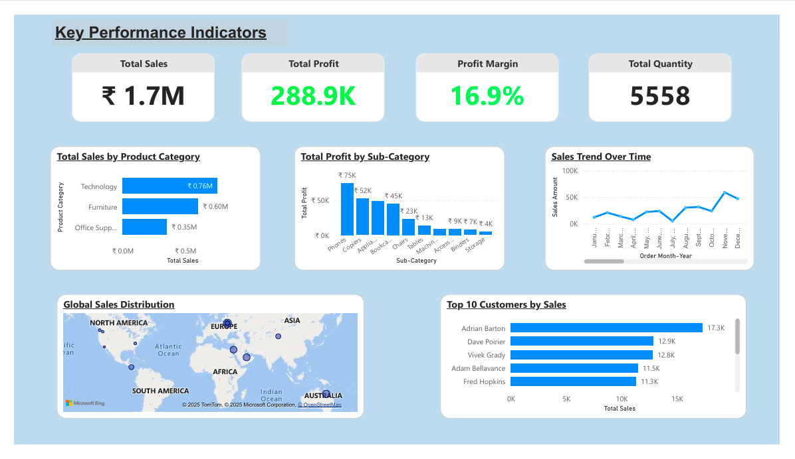

# Global Superstore Sales Dashboard (Power BI)

## 📌 Project Overview
This project analyzes Global Superstore sales data using Power BI.
It shows sales, profit, customer trends, and regional performance.

## 🛠 Tools Used
- Power BI
- Power Query
- DAX

## 📊 Dashboard Features
- KPI cards (Sales, Profit, Profit Margin, Quantity)
- Category and sub-category analysis
- Monthly sales trend
- Global sales map
- Top 10 customers
